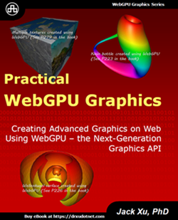
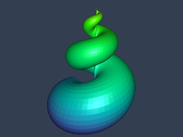
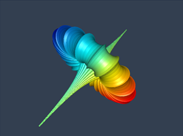
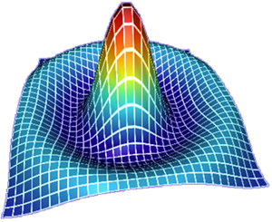

# WebGPU Graphics Programming: Step-by-Step 

WebGPU is the next-generation graphics API and future web standard for graphics and compute, aiming to provide modern 3D graphics and 
computation capabilities with the GPU acceleration. To help you be familiar with this new graphics API and able to build your WebGPU 
applications, I will create a YouTube video series about WebGPU programming and present an easy-to-follow WebGPU application in each video episode. 
This repository contains all the code examples used in this video series.

This YouTube video series uses the real-world sample apps to explain the WebGPU basics, shader program, GPU buffer, and rendering pipeline. From this video series, you will learn how to create primitives and simple objects in WebGPU. As you gradually progress through the video series, you will get to grips with advanced WebGPU topics, including 3D transformation, lighting calculation, colormaps, and textures. At the same time, you will learn how to create advanced 3D WebGPU objects, including various 3D wireframes, 3D shapes, simple and parametric 3D surfaces with 
colormaps and textures, as well as 3D surface plots and 2D and 3D fractal graphics described by complex functions. In addition, you will explore new WebGPU features, such as compute shader and storage buffer, and how to use them to simulate large particle systems.

By the end of this video series, you will have the solid skill you need to build your own GPU-accelerated graphics and computing on the web with the WebGPU API. 

## Books on WebGPU and wgpu in Rust
Most of the examples used in this video series are taken from my recently published book **"Practical WebGPU Graphics"**. 

I also published a new book **"Practical GPU Graphics with wgpu and Rust"**. Rust wgpu is based on the WebGPU standard. It is a cross-platform, safe, Rust graphics API, and it runs natively on Vulkan, Metal, D3D12, D3D11, and OpenGLES, as well as on the web via WebAssembly.

&nbsp;&nbsp;&nbsp;&nbsp;&nbsp;&nbsp; 

Please see details about these books at https://drxudotnet.com. 

## YouTube Video Links and Live Demos:

Please visit my YouTube channel: [Practical Programming with Dr. Xu](https://www.youtube.com/c/PracticalProgrammingWithDrXu)

### Video Series for WebGPU Step-by-Step:

1. Set up Development Environment: https://youtu.be/-hXtt4ioH5A  
2. Create First Triangle: https://youtu.be/QWh968pmsbg
3. Create Triangle with different Vertex Colors: https://youtu.be/h6Dqos4mfVY
4. Create a Triangle with GLSL Shaders: https://youtu.be/vmqx7rJk4uU
5. Create Point and Line Primitives: https://youtu.be/q8_uD9EMVRg
6. Create Triangle Primitives: https://youtu.be/1JMHg8BgWTY
7. Create a Colorful Square with GPU Buffer: https://youtu.be/L4k5Glv0gSM
8. Create a Colorful Square with a Single GPU Buffer: https://youtu.be/G5j5EMfHQR0
9. Create a Colorful Square with an Index GPU Buffer: https://youtu.be/Y1zUZhA8vv8
10. Create a 3D Cube with Distinct Face Colors: https://youtu.be/Ewy1QdFBLVc
11. 3D Cube Animation and Camera Control: https://youtu.be/Tbor4MHGN_I
12. 3D Cube with Distinct Vertex Colors: https://youtu.be/cU0gzGgjDS4 
13. Create a 3D Sphere Wireframe: https://youtu.be/9E_tSiybdMw
14. Create a 3D Cylinder Wireframe: https://youtu.be/hhTcmMfyGQ4
15. Create a 3D Cone Wireframe: https://youtu.be/RyowA2ytRYo
16. Create a 3D Torus Wireframe: https://youtu.be/njKt4tY0QjA
17. Implement Light Model: https://youtu.be/KCqqpXQiWcY 
18. Create a 3D Cube with Lighting Effect: https://youtu.be/jRNSVSJAadc
19. Create a 3D Sphere with Lighting Effect: https://youtu.be/SjBJKHhNJpM
20. Create a 3D Cylinder with Lighting Effect: https://youtu.be/1hN7ST3F9Sg 
21. Create a 3D Cone with Lighting Effect: https://youtu.be/0jP3srX5baw
22. Create a 3D Torus with Lighting Effect: https://youtu.be/u3CVA5rcu9I
23. Create Colormap Model: https://youtu.be/TXttBcCs63I
24. Create 3D Simple Surfaces: https://youtu.be/goWAQGyaAsc 
25. Create a 3D Sinc Surface: https://youtu.be/7T6YnXASLHc
26. Create a 3D Peaks Surface: https://youtu.be/nE_vhPSe15I
27. Create 3D Parametric Surfaces: https://youtu.be/5ZtBKHDimec
28. Create a 3D Klein Bottle: https://youtu.be/hi63TBxyPU8
29. Create a 3D Wellenkugel Surface: https://youtu.be/OvpHDloSi4M 
30. Create a 3D Seashell Surface: https://youtu.be/IuxNYrMK6rU 
31. Create a 3D Sievert-Enneper Surface: https://youtu.be/tKYD8y6FJB4
32. Create a 3D Breather Surface: https://youtu.be/YecHbHT403c
33. Texture Mapping: https://youtu.be/s5BRvGWiIOY 
34. Texture Mapping for 3D Cube: https://youtu.be/dGVd5SQluR0
35. Texture mapping for 3D Sphere: https://youtu.be/aK7gQEIhJNI
36. Texture Mapping for 3D Cylinder: https://youtu.be/nZ9dQSgNWek 
37. Texture Mapping for 3D Sinc Surface: https://youtu.be/JAPaIofg6lM 
38. Texture Mapping for 3D Peaks Surface: https://youtu.be/ec5LM6oWrZM
39. Texture Mapping for 3D Klein Bottle: https://youtu.be/x1uJZRnLFgI
40. Texture Mapping for 3D Wellenkugel Surface: https://youtu.be/HTN_IGN3XIM
41. Multiple Texture Mapping: https://youtu.be/lz8g8lmB-fU
42. 3D Surface Charts: https://youtu.be/HC6VnpKwu_8
43. 3D Sinc Surfae Chart: https://youtu.be/6a-ayeGKHSo
44. 3D Peaks Surface Chart: https://youtu.be/NW0BxAA88J8
45. 3D Sphere Surface Chart: https://youtu.be/63GuFFX5154
46. 3D Torus Surface Chart: https://youtu.be/_giImSpCULs
47. 3D Klein Bottle Surface Chart: https://youtu.be/CslHSPqelNI
48. 3D Wellenkugel Surface Chart: https://youtu.be/iVpY87AKOMI
49. Create Two Cubes in a Single Scene: https://youtu.be/lLOQZravjFE
50. Create multiple Cubes in a single Scene: https://youtu.be/b4QkRyzKPEU
51. Create multiple Different Objects in a Scene: https://youtu.be/8pMWA5ydZwI
52. Create multiple Objects using Different Pipelines: https://youtu.be/1p1Ba2wXOvw

### Live Demonstration
[Live Demos](https://jack1232.github.io/webgpu00/) are produced by running the sample projects used in the WebGPU step-by-step video series.
These samples run in Chrome Canary behind the flag --enable-unsafe-webgpu.

### Code Update Videos
1. Code Update 1: https://youtu.be/pfWVH2uaerw
2. Code Update 2: https://youtu.be/yTkGXYlIjEw
3. Code Update 3: https://youtu.be/NJ-Dr0eeTaU
4. Code Update 4: https://youtu.be/1Ydti6_-aB4
5. Code Update 5: https://youtu.be/Joeueh8HVf0
## Building

This repository organizes all samples with the git submodules. The sample apps are built with TypeScript and bundled using WebPack. Building the apps requires an installation of Node.js.

The following steps shows how to run the sample apps:

* Carefully watch the first video ( **https://youtu.be/-hXtt4ioH5A** ) to set up correct development environment. 
* Click on the link for the sample app that you are interested.
* Clone or download it to your local machine.
* Install dependencies with the command: **npm install**.
* Compile and bundle the app with the command: **npm run dev**, **npm run prod**, or **npm run watch**.
* Run the live-server from VS-Code and then navigate to **http://localhost:5500** or **http://127.0.0.1:5500** to view the app.

## Sample Objects 
Here are some sample objects created using the WebGPU API, which I will discussed in my video series.

### Klein Bottle and Wellenkugel Surface:
 &nbsp;&nbsp;&nbsp;&nbsp;&nbsp;&nbsp;  

### Snail Shell and Sievert-Enneper Surface:
 &nbsp;&nbsp;&nbsp; 

### Breather Surface and 3D Sinc Surface:
 &nbsp;&nbsp;&nbsp;  

### Multiple-Textures Created Using WebGPU:
 

## License

The MIT License (MIT).

Copyright (c) 2022 Jack Xu.

Permission is hereby granted, free of charge, to any person obtaining a copy of this software and associated documentation files (the "Software"), to deal in the Software without restriction, including without limitation the rights to use, copy, modify, merge, publish, distribute, sublicense, and/or sell copies of the Software, and to permit persons to whom the Software is furnished to do so, subject to the following conditions:

The above copyright notice and this permission notice shall be included in all copies or substantial portions of the Software.

THE SOFTWARE IS PROVIDED "AS IS", WITHOUT WARRANTY OF ANY KIND, EXPRESS OR IMPLIED, INCLUDING BUT NOT LIMITED TO THE WARRANTIES OF MERCHANTABILITY, FITNESS FOR A PARTICULAR PURPOSE AND NONINFRINGEMENT. IN NO EVENT SHALL THE AUTHORS OR COPYRIGHT HOLDERS BE LIABLE FOR ANY CLAIM, DAMAGES OR OTHER LIABILITY, WHETHER IN AN ACTION OF CONTRACT, TORT OR OTHERWISE, ARISING FROM, OUT OF OR IN CONNECTION WITH THE SOFTWARE OR THE USE OR OTHER DEALINGS IN THE SOFTWARE.
 
